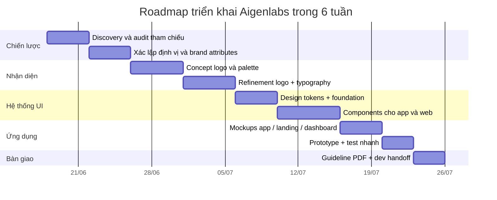

# Bộ nhận diện thương hiệu Aigenlabs

## Tóm tắt điều hành

Aigenlabs nên được xây như một thương hiệu **AI ứng dụng có độ tin cậy cao**, thiên về tư duy hệ thống hơn là “AI hào nhoáng”. Với dữ kiện hiện có, hướng phù hợp nhất là **lai giữa minimal và tech/AI**: logo gọn, có tính mô-đun; đỏ là màu nhận diện chủ lực nhưng **không phủ kín giao diện**; typography ưu tiên tiếng Việt đẹp, rõ và có chất kỹ thuật; toàn bộ app và website dùng **một hệ token thống nhất** để designer và developer bám cùng một nguồn sự thật. Cách làm này nhất quán với tinh thần của Material 3, Apple HIG và các hệ thiết kế sản phẩm lớn: màu được dùng theo vai trò, typography phải giữ được phân cấp và legibility, còn thiết kế nên thích ứng theo nền tảng và kích thước màn hình thay vì chỉ “đẹp ở Figma”. citeturn0search1turn0search8turn9search24turn2search8turn6search6turn4search0turn4search5

Tham chiếu “đỏ giống thedesigncouncil.vn” là một chỉ dẫn thị giác tốt, nhưng nên hiểu là **tham chiếu cảm giác thương hiệu** chứ không phải sao chép nguyên xi. The Design Council thể hiện rất rõ định hướng nặng về Branding, Logo, Typography, Type Design, Spacing, Atomic Design, Art Direction, UX/UI; vì vậy, điều đáng học từ tham chiếu này không chỉ là màu đỏ, mà là cách dùng **typography có chủ đích** và tư duy hệ thống xuyên suốt. citeturn1view0

Kết luận ngắn: tôi khuyến nghị Aigenlabs đi theo trục **“Precision, Velocity, Trust”**. Nghĩa là nhìn vào phải thấy sắc, nhanh, hiện đại; dùng trong sản phẩm phải thấy rõ ràng, bền, dễ mở rộng; còn khi đưa lên landing page, dashboard hay app icon vẫn giữ được một bản sắc thống nhất. Cấu trúc dưới đây được viết như một **brand guideline khởi điểm** có thể áp dụng ngay cho web, app và handoff cho dev.

## Giả định và phương pháp

Hiện chưa có các đầu vào cốt lõi như: ngành dọc cụ thể, khách hàng mục tiêu thực tế, slogan chính thức, ngân sách, deadline, danh sách kênh triển khai, và file nguồn mong muốn. Vì vậy, dưới đây là bộ giả định làm việc để tránh thiết kế bị chung chung hoặc lệch định vị.

| Mục | Trạng thái hiện tại | Giả định làm việc | Ảnh hưởng đến thiết kế |
|---|---|---:|---|
| Ngành nghề | Chưa rõ | AI product / AI tools / AI services | Cần cân bằng “công nghệ” và “độ tin cậy” |
| Tệp khách hàng | Chưa rõ | Xử lý theo 3 kịch bản: B2B tech, B2C app, startup AI | Ảnh hưởng trực tiếp đến giọng điệu và độ mạnh của màu |
| Slogan | Chưa rõ | Tạm dùng placeholder | Không nên khóa logo vào slogan ở giai đoạn đầu |
| Ngân sách | Chưa rõ | Thiết kế để triển khai theo từng phase | Ưu tiên token và component reusable |
| Deadline | Chưa rõ | Đề xuất 3 lộ trình: 2 tuần, 6 tuần, 12 tuần | Phạm vi deliverable sẽ khác nhau |
| File nguồn | Chưa rõ | Figma làm nguồn chính, xuất SVG/PNG/PDF, token JSON/CSS | Tối ưu cho dev handoff |

Về phương pháp, tôi lấy ba lớp tham chiếu chính. Lớp đầu là **tham chiếu chiến lược và tư duy nhận diện** từ The Design Council, vì đây là nguồn tham chiếu do bạn chỉ định và bản thân họ cũng tổ chức các lớp Branding Essentials, Logo Design, Typography Theory, Type Design, Spacing và Atomic Design trong design system. Lớp thứ hai là **guideline sản phẩm** từ Material 3, Android và Apple HIG để đảm bảo bộ nhận diện không chỉ dùng được trên poster mà còn sống được trong app và web. Lớp thứ ba là **design tokens, accessibility và iconography** từ W3C, Atlassian, IBM và WCAG để hệ thống có khả năng scale. citeturn1view0turn2search1turn6search10turn4search0turn4search5turn11search0turn2search2

Từ đó, mọi đề xuất trong tài liệu này đi theo nguyên tắc sau: **một hệ nhận diện mạnh phải chuyển hóa được thành hệ UI**. Đây cũng là logic chung của Material 3 khi gắn color, typography, shape với component; của Apple HIG khi nhấn mạnh khả năng dùng tốt trên nhiều appearance mode; và của các hệ token hiện đại khi coi token là “single source of truth”. citeturn2search1turn9search24turn4search5

## Phân tích thương hiệu Aigenlabs

### Giá trị cốt lõi nên giữ cố định

Dù Aigenlabs rơi vào kịch bản B2B, B2C hay startup AI, có bốn giá trị nên được xem là bất biến.

Thứ nhất là **clarity**: sản phẩm AI thường phức tạp; thương hiệu phải làm cho cảm nhận trở nên rõ và dễ hiểu hơn. Điều này ăn khớp với định hướng typography và hierarchy của Apple HIG và Material, nơi legibility và information hierarchy luôn được đặt lên trước biểu diễn thị giác thuần túy. citeturn0search9turn2search8

Thứ hai là **trust**: AI càng mạnh càng cần biểu hiện đáng tin. Về màu sắc và UI, điều này đồng nghĩa với semantic color rõ ràng, contrast đạt chuẩn, và component phản hồi đúng ngữ cảnh. WCAG yêu cầu contrast tối thiểu 4.5:1 cho văn bản thường, 3:1 cho thành phần phi văn bản và focus appearance đủ nổi bật để người dùng định vị tương tác. citeturn2search5turn2search13turn2search21

Thứ ba là **velocity**: Aigenlabs phải trông như một công ty biết ship sản phẩm, không phải một phòng nghiên cứu khép kín. Vì thế nhận diện cần có cảm giác nhanh, gọn, dứt khoát; nhưng không được “ồn”. Đây là điểm tôi chọn màu đỏ làm tín hiệu năng lượng, còn phần còn lại của giao diện sẽ trung tính và có kỷ luật.

Thứ tư là **system thinking**: tên “labs” gợi thực nghiệm, nhưng với sản phẩm số, thực nghiệm chỉ hữu ích khi có cấu trúc. Các hệ như Material 3, Atlassian Tokens hay IBM Design Language đều xây thiết kế theo nền tảng system-driven thay vì từng màn hình rời rạc. citeturn2search1turn4search5turn11search4

### Tính cách thương hiệu đề xuất

Aigenlabs nên được định vị với phổ tính cách như sau:

| Trục tính cách | Mức đề xuất | Ý nghĩa triển khai |
|---|---:|---|
| Kỹ thuật ↔ Cảm xúc | 70/30 nghiêng kỹ thuật | Có chiều sâu nhưng không khô |
| Tối giản ↔ Phô diễn | 75/25 nghiêng tối giản | Gọn, kiểm soát tốt, ít tạp âm |
| Nghiêm túc ↔ Năng động | 60/40 | Đủ chuyên nghiệp để bán B2B, đủ nhanh để hợp startup |
| Cao cấp ↔ Đại chúng | 65/35 | Nhìn premium nhưng không xa cách |
| Thử nghiệm ↔ Ổn định | 45/55 | “Experimental under control” |

Câu mô tả ngắn gọn nhất cho cá tính thương hiệu là: **“Sắc, rõ, có chiều sâu kỹ thuật, nhưng vẫn dễ dùng với con người.”**

### Ba kịch bản đối tượng người dùng giả định

#### B2B tech

Nếu Aigenlabs là công ty bán giải pháp AI cho doanh nghiệp, nhận diện nên nghiêng về **độ tin cậy, tích hợp, hiệu suất và khả năng mở rộng**. Màu đỏ ở đây nên dùng như brand signal trên CTA, trạng thái quan trọng, heading highlight và chi tiết nhận diện; không nên để nền đỏ lớn ở các màn sản phẩm chính. Typography cần bình tĩnh, có trọng lượng; dashboard ưu tiên tính đọc nhanh và diện tích dữ liệu. Cách này phù hợp với tinh thần dùng **color roles** và **adaptive colors** của Material và Apple thay vì để brand color chi phối toàn bộ giao diện. citeturn0search8turn9search24

#### B2C app

Nếu Aigenlabs là app hướng người dùng cuối, thương hiệu vẫn có thể giữ đỏ làm chủ đạo nhưng phải **mềm hơn, thân thiện hơn, nhiều khoảng trắng hơn**. Các interaction cần nhanh và rõ; text ngắn, trực tiếp; onboarding nên thiên về lợi ích hơn là công nghệ. Apple khuyến nghị search field, text field, alerts và sheet đều phải rõ mục đích và không gây quá tải nhận thức; điều này rất hợp với luồng B2C. citeturn9search1turn9search3turn9search4turn9search15

#### Startup AI

Nếu Aigenlabs là startup AI ở giai đoạn tăng trưởng sớm, nên giữ cảm giác **sắc và có năng lượng**, nhưng phải tránh ba cliché thường gặp: não-neon, lưới số vô nghĩa, gradient AI quá lạm dụng. M3 Expressive cho thấy một thương hiệu công nghệ vẫn có thể giàu cảm xúc mà không đánh mất cấu trúc; tuy nhiên với một thương hiệu mới, tôi vẫn ưu tiên “less drama, more precision”. citeturn15search12turn2search1

### Định vị khuyến nghị

Giữa ba kịch bản trên, hướng an toàn và bền nhất cho Aigenlabs là:

**Aigenlabs = công ty AI product-first, thiên B2B/B2B2C, có giao diện đủ premium để thuyết phục đối tác và đủ trực quan để scale sang người dùng cuối.**

Điều này dẫn đến một quyết định rõ: **visual direction nên chọn “minimal x tech/AI”, không chọn “energetic/startup” làm hướng chính**. Hướng energetic có thể dùng cho campaign, launch và social, nhưng không nên là bộ xương của hệ nhận diện.

## Hệ thống nhận diện cốt lõi

### Kiến trúc logo đề xuất

Tôi đề xuất logo Aigenlabs theo kiến trúc **wordmark + monogram + app icon**, thay vì chỉ làm một biểu tượng độc lập.

**Ý tưởng logo chính**: một chữ **A** cách điệu cấu thành từ hai nét chéo chắc, phần âm bản ở giữa tạo cảm giác như một “beam”, “path” hoặc “inference channel”. Nếu muốn nhấn mạnh yếu tố “labs”, có thể thêm một nút vi mô hoặc lát cắt hình học ở chân phải để gợi cảm giác hệ thống đang được tinh chỉnh trong phòng lab. Kinh nghiệm từ các hệ logo mạnh cho thấy biểu tượng tốt thường bám vào **một khái niệm đơn** và giữ legibility ở kích thước nhỏ; Apple cũng nhấn mạnh icon phải đơn giản và dễ nhận ra ở nhiều kích thước khác nhau. citeturn13search1turn13search21

Tôi khuyến nghị bộ logo gồm bốn trạng thái:

| Biến thể | Mục đích |
|---|---|
| Primary horizontal | Website header, landing page, sales deck, báo giá |
| Secondary stacked | Social cover, poster, splash screen dọc |
| Symbol only | Favicon, app icon, avatar, watermark |
| Monochrome / Reverse | Khi dùng trên nền ảnh, nền tối, tài liệu in đen trắng |

**Quy tắc hình học đề xuất**
- Tỷ lệ symbol: 1:1
- Tỷ lệ khối của chữ A: nghiêng vừa phải, không quá “racing”
- Góc bo: 8–12% độ dày nét, để logo có cảm giác hiện đại nhưng không mềm yếu
- Khoảng hở âm bản trong chữ A phải đủ lớn để còn đọc được ở 16–24 px

**Khoảng cách an toàn và tối thiểu**
Tôi khuyến nghị đặt một đơn vị `x` bằng **độ rộng của beam âm bản trong chữ A**. Khoảng cách an toàn quanh logo là **1x** ở mọi phía. Kích thước tối thiểu nên là:

| Biến thể | Digital tối thiểu | Print tối thiểu |
|---|---:|---:|
| Wordmark ngang | 120 px | 28 mm |
| Stacked | 72 px | 18 mm |
| Symbol/Favicon | 16 px khả dụng, 24 px ưu tiên | 8 mm |

Với app/web icon, nên giữ **ít chi tiết** và xuất phát từ một master vector. MDN khuyến nghị favicon thường là 16×16; web app icon nên có bản scalable hoặc ít nhất đủ lớn, ưu tiên SVG hoặc asset có thể scale tới 1024×1024; phía Apple cho phép tạo các biến thể app icon từ một nguồn 1024×1024 trong asset catalog. citeturn2search3turn13search6turn13search4

### Màu sắc nhận diện

Màu đỏ là trung tâm của Aigenlabs, nhưng bản sắc không nên phụ thuộc vào **một mảng đỏ lớn**. Cách bền vững hơn là dùng đỏ như **màu kích hoạt** cho nhận diện, còn UI vận hành bằng semantic roles. Đây là hướng rất sát với Material 3 color roles và triết lý adaptive color của Apple. citeturn0search8turn9search24

Tôi đề xuất palette lõi như sau.

| Token | HEX | RGB | CMYK | Vai trò |
|---|---|---|---|---|
| Brand Red 500 | `#C61F26` | 198, 31, 38 | 0, 84, 81, 22 | Màu thương hiệu chính |
| Brand Red 600 | `#B21C22` | 178, 28, 34 | 0, 84, 81, 30 | Hover / pressed / border đậm |
| Brand Red 800 | `#811419` | 129, 20, 25 | 0, 84, 81, 49 | Text trên nền sáng khi cần nhấn mạnh |
| Brand Red 100 | `#F4D2D4` | 244, 210, 212 | 0, 14, 13, 4 | Surface thương hiệu nhẹ |
| Brand Red 50 | `#F9E9E9` | 249, 233, 233 | 0, 6, 6, 2 | Tinted background / tag |
| White | `#FFFFFF` | 255, 255, 255 | 0, 0, 0, 0 | Nền chính / chữ trên brand red |
| Neutral 50 | `#F4F6F8` | 244, 246, 248 | 2, 1, 0, 3 | Surface phụ |
| Neutral 300 | `#D0D5DD` | 208, 213, 221 | 6, 4, 0, 13 | Border / divider |
| Neutral 500 | `#667085` | 102, 112, 133 | 23, 16, 0, 48 | Text phụ |
| Neutral 900 | `#101828` | 16, 24, 40 | 60, 40, 0, 84 | Text chính / surface tối |
| Accent Cyan | `#16B3A3` | 22, 179, 163 | 88, 0, 9, 30 | Data viz / trạng thái thông tin |
| Accent Amber | `#FDB022` | 253, 176, 34 | 0, 30, 87, 1 | Cảnh báo / badge / chart highlight |

**Quy tắc dùng màu**

| Trường hợp | Quy tắc |
|---|---|
| Logo chuẩn | Đỏ trên nền trắng hoặc trắng trên nền đỏ |
| CTA chính | Brand Red 500 nền đặc, chữ trắng |
| Giao diện nội dung dài | Nền trắng hoặc neutral 50, text neutral 900 |
| Badge / alert mềm | Brand Red 50 hoặc Amber rất nhạt |
| Dashboard / data views | Dùng accent cyan/amber cho dữ liệu, không trộn quá nhiều đỏ với dữ liệu |
| Dark mode | Nền neutral 900, đỏ sáng hơn một nấc nếu cần giữ độ nổi |

Về accessibility, text thường cần contrast tối thiểu 4.5:1; thành phần phi văn bản và focus indicator cần ít nhất 3:1. Vì vậy, **không dùng Accent Cyan trên nền trắng cho text chính**, và **không dùng Neutral 300 cho text**. Màu đỏ chính đề xuất đủ an toàn khi đặt chữ trắng bên trên cho button/CTA, còn neutral 900 nên là màu mặc định cho body text. citeturn2search5turn2search13turn2search21

### Typography

Aigenlabs cần một hệ chữ vừa **đẹp tiếng Việt**, vừa **đủ chất kỹ thuật**, vừa dễ triển khai trên web và app. Tôi đề xuất cấu trúc hai lớp:

- **Font headline / display:** **Space Grotesk**
- **Font UI / body:** **Be Vietnam Pro**
- **Fallback hệ thống:** `ui-sans-serif, system-ui, -apple-system, BlinkMacSystemFont, "SF Pro Text", "Segoe UI", Roboto, Helvetica, Arial, sans-serif`

Lý do chọn như sau. Space Grotesk có hỗ trợ Latin Vietnamese và giữ được chất công nghệ ở headline. Be Vietnam Pro được mô tả là neo-grotesk phù hợp với tech companies và startups, đồng thời đã được tinh chỉnh tốt cho dấu tiếng Việt. Trên hệ Apple, SF Pro là system font chính thức với nhiều weight và optical sizes, nên việc đưa SF Pro vào fallback stack giúp trải nghiệm native feel hơn trên thiết bị Apple. citeturn12search1turn12search2turn3search2turn3search16

| Vai trò | Font | Weight | Size / Leading | Dùng cho |
|---|---|---:|---:|---|
| Display XL | Space Grotesk | 700 | 64 / 72 | Hero landing, keynote title |
| Display L | Space Grotesk | 700 | 48 / 56 | H1 landing, section mở đầu |
| Heading M | Space Grotesk | 600 | 32 / 40 | H2 |
| Heading S | Space Grotesk | 600 | 24 / 32 | H3 |
| Title L | Be Vietnam Pro | 600 | 20 / 28 | Card title, modal title |
| Body L | Be Vietnam Pro | 400 | 18 / 28 | Landing body lớn |
| Body M | Be Vietnam Pro | 400 | 16 / 24 | Nội dung mặc định web/app |
| Body S | Be Vietnam Pro | 400 | 14 / 20 | Bảng biểu, meta |
| Label M | Be Vietnam Pro | 500 | 14 / 20 | Button, input label |
| Caption | Be Vietnam Pro | 500 | 12 / 16 | Helper text, footnote |

**Quy tắc vận hành**
- Không dùng quá 2 font family trong giao diện chính.
- Dùng Space Grotesk chủ yếu ở heading, slogan, con số lớn, key stat.
- Dùng Be Vietnam Pro cho toàn bộ UI, form, danh mục, dashboard, blog, docs.
- Dashboard có thể bổ sung **mono** cho code/data nếu cần, nhưng chỉ là lớp phụ.

Typography trong UI nên phục vụ legibility và hierarchy trước, vì đó là logic chung của Apple HIG và Material typography. citeturn0search9turn2search8

### Iconography và imagery

Về iconography, tôi đề xuất một hệ icon được dựng theo **24 px grid**, stroke 1.75–2 px, bo ngoài nhẹ, góc trong rõ, tỷ lệ mang cảm giác “engineering” hơn là playful. Hệ này có thể tham chiếu tinh thần từ Material Symbols, SF Symbols và IBM iconography: icon phải đủ thống nhất với typeface, dễ hiểu ở glance level và tương thích với nhiều trọng lượng hiển thị. citeturn2search4turn3search6turn6search28turn11search8turn11search11

**Nguyên tắc ảnh và hình minh họa**
- Ưu tiên ảnh thật: con người đang làm việc với sản phẩm, không khí lab/product team, màn hình thật, chi tiết vật liệu công nghệ.
- Tránh kiểu ảnh stock “bắt tay trong văn phòng”, “não số hóa”, “wireframe không nội dung”.
- Overlay ảnh bằng một lớp neutral tối rất mỏng hoặc tint đỏ cực nhẹ để hợp bộ màu.
- Min họa nên đi theo hình học phẳng, ít chi tiết, dùng mảng lớn có grid rõ; đây cũng gần với tinh thần illustration system có cấu trúc như IBM. citeturn11search20

**Shot-list để tìm stock đúng tinh thần**
- “AI engineer reviewing dashboards”
- “team collaborating around product screen”
- “clean data center textures / hardware details”
- “close-up interface on laptop in studio”
- “abstract geometric light and shadow”

## Hệ thống UI cho app và web

### Kiến trúc token thiết kế

Một hệ nhận diện dùng được thật sự phải sống bằng token, không phải bằng “mắt designer nhớ màu”. W3C Design Tokens Community Group đang chuẩn hóa định dạng để trao đổi token giữa công cụ; Atlassian mô tả design tokens như **single source of truth** cho design decisions. Với Aigenlabs, đây là hướng nên đi ngay từ đầu. citeturn4search0turn4search4turn4search5

**Bảng token lõi**

| Nhóm token | Token | Giá trị đề xuất |
|---|---|---|
| Color | `color.brand.primary` | `#C61F26` |
| Color | `color.brand.primary-hover` | `#B21C22` |
| Color | `color.text.primary` | `#101828` |
| Color | `color.text.secondary` | `#667085` |
| Color | `color.surface.default` | `#FFFFFF` |
| Color | `color.surface.subtle` | `#F4F6F8` |
| Color | `color.border.default` | `#D0D5DD` |
| Color | `color.info` | `#16B3A3` |
| Color | `color.warning` | `#FDB022` |
| Radius | `radius.sm` | `8px` |
| Radius | `radius.md` | `12px` |
| Radius | `radius.lg` | `16px` |
| Radius | `radius.pill` | `999px` |
| Spacing | `space.1` | `4px` |
| Spacing | `space.2` | `8px` |
| Spacing | `space.3` | `12px` |
| Spacing | `space.4` | `16px` |
| Spacing | `space.6` | `24px` |
| Spacing | `space.8` | `32px` |
| Spacing | `space.10` | `40px` |
| Elevation | `shadow.sm` | `0 1px 2px rgba(16,24,40,.06)` |
| Elevation | `shadow.md` | `0 8px 24px rgba(16,24,40,.08)` |
| Elevation | `shadow.lg` | `0 16px 40px rgba(16,24,40,.12)` |
| Focus | `focus.ring` | `0 0 0 2px #101828` hoặc `0 0 0 2px #C61F26` tùy nền |

**Mẫu token JSON khởi tạo**

```json
{
  "color": {
    "brand": {
      "primary": { "$value": "#C61F26" },
      "primaryHover": { "$value": "#B21C22" },
      "surface": { "$value": "#F9E9E9" }
    },
    "text": {
      "primary": { "$value": "#101828" },
      "secondary": { "$value": "#667085" }
    },
    "border": {
      "default": { "$value": "#D0D5DD" }
    }
  },
  "space": {
    "1": { "$value": "4px" },
    "2": { "$value": "8px" },
    "4": { "$value": "16px" },
    "8": { "$value": "32px" }
  },
  "radius": {
    "sm": { "$value": "8px" },
    "md": { "$value": "12px" },
    "lg": { "$value": "16px" }
  }
}
```

### Grid và responsive system

Để dùng đồng nhất cho app và web, tôi khuyến nghị một **hệ 8-pt spacing** đi cùng grid thích ứng. Android/Material nhấn mạnh 8dp grid, width classes Compact/Medium/Expanded và adaptive layout theo không gian màn hình; IBM dùng 2x Grid để giữ trật tự và nhịp thị giác trên nhiều loại bề mặt. citeturn6search15turn6search12turn6search0turn6search5turn11search4

**Đề xuất grid**
- Mobile: 4 cột, gutter 16, margin 16
- Tablet: 8 cột, gutter 24, margin 24
- Desktop: 12 cột, gutter 24, margin 80 hoặc container 1200–1280
- Wide desktop: 12 cột, giữ content max-width 1440 để tránh loãng

**Kích thước tương tác**
- App iOS: tối thiểu 44×44 pt
- App Android / web touch-first: tối thiểu 48×48 px
- Khoảng cách giữa các nút cạnh nhau đủ rộng để tránh chạm nhầm

Các ngưỡng trên bám tinh thần accessibility chính thức từ Apple và Android. citeturn16search3turn16search13turn16search0turn16search2

### Component system áp dụng cho app và web

Material 3 và Jetpack Compose mô tả top app bars là nơi đặt navigation, actions và tiêu đề; buttons là thành phần kích hoạt hành động; text fields để nhập/chỉnh sửa; cards là container nội dung cùng chủ đề; dialogs dùng cho xác nhận hoặc nhập liệu; snackbars/toasts dùng cho phản hồi ngắn, không làm gián đoạn. Apple HIG cũng phân biệt rõ buttons, text fields, alerts, sheets và search fields theo đúng ngữ cảnh sử dụng. Vì vậy, Aigenlabs nên xây component theo **semantic role**, không bẻ thành quá nhiều style vô nghĩa. citeturn2search0turn15search19turn15search5turn15search6turn5search7turn5search10turn9search4turn9search15turn9search3turn9search1

**Bộ component khuyến nghị**

| Component | Quy cách đề xuất | Ghi chú |
|---|---|---|
| Header / Navbar | Cao 72px desktop, 64px mobile | Logo trái, nav giữa, CTA phải |
| Primary button | Nền đỏ `#C61F26`, chữ trắng, bán kính 12, cao 48 | CTA chính |
| Secondary button | Nền trắng, border đỏ, chữ đỏ | Hành động cấp 2 |
| Ghost button | Nền trong suốt, chữ neutral 900 hoặc đỏ | Toolbar / link actions |
| Text field | Cao 48, outlined, label trên, helper/error dưới | Dùng trạng thái rõ ràng |
| Search field | Có icon search + clear action | Phù hợp docs, dashboard |
| Card | Surface trắng, border subtle, radius 16, padding 16–24 | Không lạm dụng bóng |
| Modal / Dialog | Desktop 480–640, mobile dùng bottom sheet khi cần | Nội dung ngắn, quyết định quan trọng |
| Toast / Snackbar | Desktop góc phải dưới, mobile đáy màn hình | Auto-dismiss 4 giây nếu không critical |
| Data table | Header cố định, row padding thoáng, zebra rất nhẹ nếu cần | Dashboard / admin |
| Tabs / Segmented | Dùng để chuyển context đồng cấp | Không dùng thay breadcrumb |

**Trạng thái component**
- Hover: darken 6–10%
- Pressed: darken 12–16%
- Focus: ring tối thiểu 2 px, đạt contrast rõ
- Disabled: giảm saturation và opacity nhưng vẫn còn legible
- Error: không dùng đỏ brand nguyên xi cho mọi lỗi; dùng sắc đỏ semantic riêng nếu cần phân biệt giữa “brand” và “error”

### Wireframe sơ bộ

#### App home

```text
┌──────────────────────────────────────┐
│  Aigenlabs                    ⌕  ☰   │
├──────────────────────────────────────┤
│  Chào buổi sáng, Vỹ                   │
│  AI workflows hoạt động ổn định       │
│  [Tạo workflow mới]                   │
│                                      │
│  ┌──────── KPI Card ────────┐         │
│  │  124 runs     +18%       │         │
│  └──────────────────────────┘         │
│  ┌──────── Recent jobs ─────┐         │
│  │  Model audit             │         │
│  │  Dataset sync            │         │
│  └──────────────────────────┘         │
│                                      │
│  [Home] [Runs] [Datasets] [Profile]  │
└──────────────────────────────────────┘
```

**Mockup visual đề xuất**
Nền trắng hoặc neutral 50. Top bar gọn, logo đỏ trên nền sáng. Hero card dùng brand red rất tiết chế: nền `Brand Red 50`, text `Neutral 900`, CTA đỏ đặc. KPI card dùng numerals Space Grotesk. Các thẻ còn lại giữ trung tính để đỏ không bị mệt.

#### Landing page

```text
┌──────────────────────────────────────────────────────────────┐
│ Logo       Product   Solutions   Docs   Pricing   [Book demo]│
├──────────────────────────────────────────────────────────────┤
│ H1: Build reliable AI products faster                       │
│ Đưa AI từ thử nghiệm sang vận hành với hệ sản phẩm rõ ràng  │
│ [Bắt đầu]   [Xem tài liệu]                                  │
│                                      [Hero illustration]    │
├──────────────────────────────────────────────────────────────┤
│ Logo strip / trust bar                                      │
├──────────────────────────────────────────────────────────────┤
│ 3 value cards: Precision / Velocity / Governance            │
├──────────────────────────────────────────────────────────────┤
│ Product screenshots / dashboard preview                     │
├──────────────────────────────────────────────────────────────┤
│ CTA banner                                                  │
└──────────────────────────────────────────────────────────────┘
```

**Mockup visual đề xuất**
Hero dùng nền trắng, headline đen đậm, một đường nét hoặc khối đỏ tạo trục thị giác. Hình minh họa hero là mô hình lưới hình học có vùng sáng đỏ–trắng, không dùng sci-fi neon. Trust bar dùng neutral. CTA cuối trang mới cho khối đỏ lớn để dồn năng lượng.

#### Dashboard

```text
┌──────────────────────────────────────────────────────────────┐
│ Logo  Workspace ▼   Search ____________________   Alerts  Me │
├───────────────┬──────────────────────────────────────────────┤
│ Overview      │ KPI row                                      │
│ Models        │ ┌────┐ ┌────┐ ┌────┐ ┌────┐                  │
│ Datasets      │                                            │
│ Workflows     │ Activity chart        Health status         │
│ Billing       │                                            │
│ Settings      │ Recent runs table                           │
│               │                                            │
└───────────────┴──────────────────────────────────────────────┘
```

**Mockup visual đề xuất**
Sidebar rất tiết chế, active state bằng red tint chứ không tô đặc toàn hàng. Data visualization ưu tiên cyan/amber/gray; đỏ chỉ dùng cho cảnh báo quan trọng hoặc series brand-origin. Điều này giúp dashboard đỡ “báo động giả” và giữ logic semantic.

### Mẫu copy UI theo component

| Ngữ cảnh | Copy mẫu |
|---|---|
| CTA chính | Bắt đầu ngay |
| CTA phụ | Xem tài liệu |
| Trống dữ liệu | Chưa có workflow nào. Tạo workflow đầu tiên để bắt đầu. |
| Thành công | Đã lưu thay đổi. |
| Lỗi nhẹ | Không thể tải dữ liệu. Thử lại sau ít phút. |
| Cảnh báo | Mô hình này cần duyệt lại trước khi triển khai. |
| Search empty | Không có kết quả phù hợp với từ khóa này. |
| Form helper | Dùng tên ngắn, rõ, dễ tìm lại sau này. |
| Confirm dialog | Bạn có chắc muốn xoá workflow này? |
| Billing prompt | Nâng cấp để mở thêm giới hạn suy luận. |

## Tone of voice và quy chuẩn triển khai

### Tone of voice

GitHub Primer mô tả voice tốt là **clear but not cold, conversational but not jargon-y, inclusive, helpful**; Atlassian khuyến nghị viết bao trùm và rõ ràng; Apple cũng liên tục nhấn mạnh tính ngắn gọn, trực tiếp và label phải hiểu được cả khi đứng riêng. Đó là nền hợp lý cho Aigenlabs: **rõ, trực tiếp, có năng lực, không diễn, không lên lớp**. citeturn11search2turn11search5turn11search6turn14search6turn14search8

**Hệ quy tắc giọng điệu đề xuất**
- Nói như một đội ngũ hiểu kỹ thuật, nhưng không trút jargon lên người dùng.
- Ưu tiên câu ngắn, active voice, động từ rõ.
- Không dùng giọng “quá hype”.
- Không dùng kiểu hứa hẹn rỗng: “best”, “revolutionary”, “world-class”.
- Trong lỗi và cảnh báo: bình tĩnh, cụ thể, có hướng xử lý.
- Trong onboarding và marketing: nêu lợi ích trước, công nghệ sau.

**Từ vựng nên ưu tiên**
- rõ ràng
- đáng tin
- triển khai
- kiểm soát
- tăng tốc
- hệ thống
- ứng dụng thực tế

**Từ vựng nên hạn chế**
- ma thuật
- siêu thông minh
- đột phá vô hạn
- one-click everything
- fully autonomous nếu chưa thật sự đúng

### Checklist cho designer và developer

| Vai trò | Checklist |
|---|---|
| Designer | Dùng đúng token, không tự bẻ màu ngoài palette, không tạo button “phiên bản thứ 7” nếu chưa có lý do |
| Designer | Kiểm tra logo ở 16px, 24px, 32px trước khi chốt |
| Designer | Test light/dark nếu sản phẩm có dark mode |
| Designer | Kiểm tra copy UI bằng tiếng Việt thật, không chỉ lorem ipsum |
| Developer | Map token vào CSS variables / TS / platform theme ngay từ đầu |
| Developer | Không hard-code màu hex trong component |
| Developer | Bảo đảm hit target tối thiểu 44pt iOS, 48dp Android/web touch |
| Developer | Kiểm tra contrast, focus ring, keyboard navigation |
| QA | So sánh Figma và build trên 3 breakpoint: mobile, tablet, desktop |
| PM / Brand owner | Duyệt tên component, tên file, quy tắc versioning trước khi scale |

### Xuất file và naming convention

Apple Design Resources cung cấp template chính thức cho Figma và Sketch; MDN và Apple đều có hướng dẫn rõ cho icon web/app; W3C DTCG giúp chuẩn hóa token để trao đổi giữa tool. Vì vậy, pipeline hợp lý cho Aigenlabs là: **Figma library → token JSON/CSS → asset export → docs PDF**. citeturn13search10turn13search3turn13search4turn4search0

**Định dạng xuất file**
- Logo master: `SVG`, `PDF`
- Web raster: `PNG` @1x, @2x, @3x
- Favicon: `SVG`, `ICO`, `PNG` 16 / 32 / 48
- Apple touch icon: `PNG` 180×180
- PWA icon: `PNG` 192×192, 512×512
- App icon source master: `PNG` 1024×1024 + vector source
- Guideline: `PDF`
- Design system source: `Figma`
- Optional: `sketch` nếu team cần song song

**Naming convention đề xuất**
- `ALG/Color/Brand/Primary/500`
- `ALG/Typography/Body/M`
- `ALG/Button/Primary/Large/Default`
- `ALG/Card/Metric/Default`
- `ALG/Icon/Outline/24/Search`

**Tên file**
- `aigenlabs-logo-primary-red.svg`
- `aigenlabs-logo-reverse-white.svg`
- `aigenlabs-symbol-favicon-32.png`
- `aigenlabs-appicon-master-1024.png`
- `aigenlabs-brand-guideline-v1.0.pdf`
- `aigenlabs-design-tokens-v1.0.json`

## So sánh hướng thị giác, roadmap và nguồn tham khảo

### So sánh ba visual direction

| Hướng | Mô tả | Ưu điểm | Nhược điểm | Phù hợp với Aigenlabs |
|---|---|---|---|---|
| Minimal | Nhiều khoảng trắng, type-led, ít hiệu ứng, màu dùng kỷ luật | Premium, bền, hợp B2B, dễ scale | Nếu làm non tay sẽ bị lạnh và “thiếu AI” | **Cao** |
| Tech/AI | Hình học hệ thống, abstract signal, data-driven visual | Đúng ngành, có chất sản phẩm, hợp dashboard | Dễ trượt sang cliché nếu lạm dụng | **Rất cao** |
| Energetic/Startup | Đỏ mạnh, contrast cao, chuyển động nhiều, CTA giàu năng lượng | Hợp launch, social, ads, pitch deck | Dễ mệt mắt, kém bền cho sản phẩm dài hạn | **Trung bình** |

**Khuyến nghị cuối cùng**
Chọn **Minimal làm nền**, **Tech/AI làm lớp đặc trưng**, và chỉ mượn **Energetic/Startup** cho campaign. Nói ngắn gọn:
**Core brand = minimal tech**
**Campaign layer = energetic**

### Roadmap triển khai

**Kịch bản gọn trong 2 tuần**
Phù hợp khi cần chốt nhanh để launch website hoặc deck gọi vốn. Deliverables nên giới hạn ở: logo cơ bản, palette, typography, landing page concept, một bộ button/input/card cơ bản, guideline ngắn 15–25 trang.

**Kịch bản chuẩn trong 6 tuần**
Đây là phương án tôi khuyến nghị. Có đủ thời gian để làm discovery, audit tham chiếu, logo refinement, design token, hệ component vừa đủ, 3 mockup chính, prototype và handoff.

**Kịch bản đầy đủ trong 12 tuần**
Phù hợp khi muốn làm nghiêm túc: brand strategy workshop, naming/tagline refinement, motion principles, illustration system, social kit, sales deck, website/library đồng bộ, dark mode, QA với dev.

| Kịch bản | Thời lượng | Deliverables chính |
|---|---:|---|
| Sprint | 2 tuần | Mini brand kit + web landing starter |
| Standard | 6 tuần | Brand system + UI starter kit + mockups + handoff |
| Full stack brand | 12 tuần | Brand strategy + identity + product design system + governance |

**Mermaid timeline cho kịch bản 6 tuần**



### Bộ tài liệu bàn giao nên có

Khi kết thúc dự án, gói giao chuẩn nên gồm:

| Nhóm tài liệu | Nội dung |
|---|---|
| Brand core | Logo pack, safe area, min size, misuse |
| Identity foundations | Màu, typography, iconography, imagery |
| Product UI | Token, grid, component states, examples |
| Mockups | App home, landing page, dashboard |
| Ops | Naming, versioning, export rules |
| Delivery | Figma library, asset folder, guideline PDF, token JSON/CSS |

### Nguồn tham khảo ưu tiên

Tôi ưu tiên các nguồn dưới đây vì đều là nguồn chính thức hoặc gần chính thức, có giá trị áp dụng trực tiếp cho brand system và product UI.

| Mức ưu tiên | Nguồn | Vai trò sử dụng |
|---|---|---|
| Rất cao | The Design Council | Tham chiếu tinh thần đỏ–trắng, nhấn mạnh branding, typography, spacing, atomic design, art direction citeturn1view0 |
| Rất cao | Material 3 / Android Developers | Color roles, adaptive layout, components, theming, spacing, touch targets citeturn0search1turn0search8turn2search1turn15search19turn15search5turn15search6turn16search0 |
| Rất cao | Apple Human Interface Guidelines + Apple Design Resources | Color, typography, buttons, text fields, alerts, sheets, icons, Figma/Sketch resources citeturn9search24turn3search16turn9search4turn9search15turn9search3turn13search10 |
| Cao | WCAG / W3C | Contrast, focus, accessibility, token standard hóa citeturn2search2turn2search5turn2search13turn4search0turn4search4 |
| Cao | IBM Design Language | Grid, iconography, system thinking, typographic discipline citeturn11search4turn11search8turn11search11 |
| Cao | Atlassian Design / Primer | Token governance, voice and tone, docs consistency citeturn4search5turn11search2turn11search5turn11search6 |

**Kết luận thực thi**
Nếu phải chốt một hướng duy nhất ngay bây giờ, tôi sẽ chốt như sau:

- **Logo:** wordmark + monogram chữ A có âm bản gợi inference path
- **Màu:** đỏ `#C61F26` + trắng + neutral lạnh + cyan/amber cho data/status
- **Font:** Space Grotesk cho headline, Be Vietnam Pro cho UI/body
- **Visual direction:** minimal-tech, đỏ là tín hiệu chứ không phải nền mặc định
- **Sản phẩm:** một bộ token chung cho web và app, component bám semantic roles
- **Tài liệu bàn giao:** brand guideline PDF + Figma library + token JSON/CSS + mockups chính

Nếu Aigenlabs sau này xác định rõ hơn là B2B platform, B2C app hay AI infra startup, bộ guideline này vẫn giữ nguyên được khoảng **70–80% cấu trúc**, chỉ cần tinh chỉnh thêm về giọng điệu, tỉ lệ màu đỏ, mức độ sắc của type và độ “nhiệt” của visual layer.